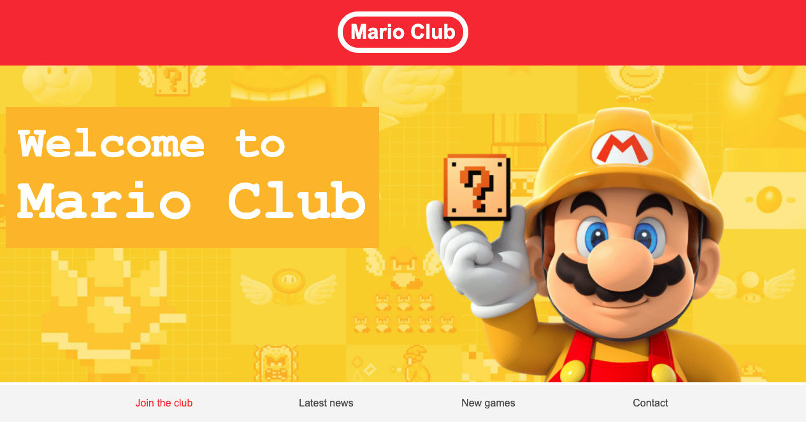
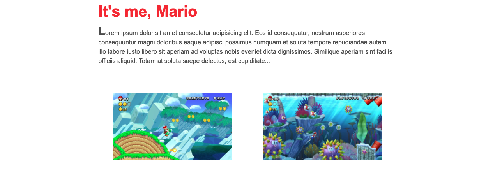
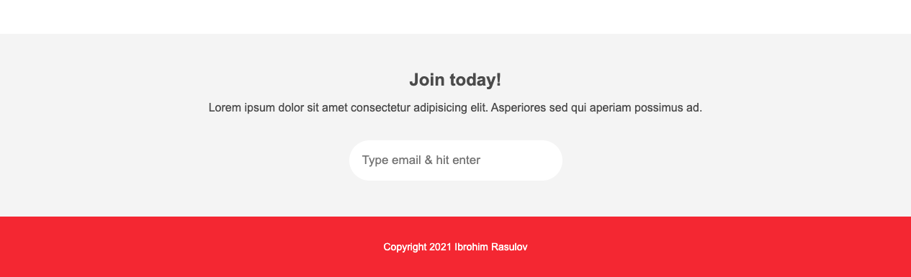

# Project Name

> One paragraph statement about the project.





Additional description about the project and its features.

## Built With

- HTML & CSS
- No frameworks is used
- VS Code, GitHub Pages

## Live Demo

[Live Demo Link](https://ibrohimrasulov.github.io/HTML-CSS-Crash-Course/)

### Run tests
```
npx hint .
npx stylelint "**/*.{css,scss}"
```

## Authors

👤 **Ibrohim Rasulov**

- [GitHub](https://github.com/IbrohimRasulov)
- [Twitter](https://twitter.com/IbrohimRasu1ov)
- [LinkedIn](https://www.linkedin.com/in/ibrohim-rasulov-a88352209/)

## 🤝 Contributing

Contributions, issues, and feature requests are welcome!

Feel free to check the [issues page](../../issues/).

## Show your support

Give a ⭐️ if you like this project!

## Acknowledgments

- Hat tip to anyone whose code was used
- Inspiration
- etc

## 📝 License

This project is [MIT](./MIT.md) licensed.
